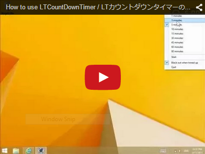
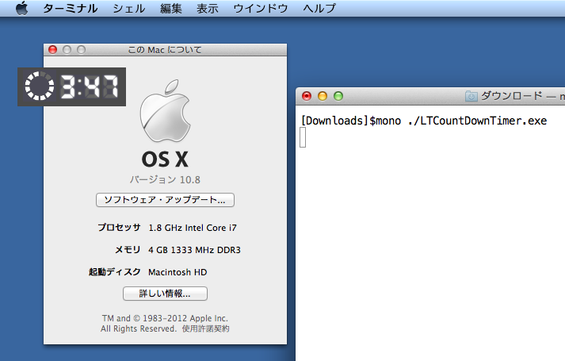

# Lightning Talks Countdown Timer

This application is countdown timer for Lightning Talks, or any presentation.  
ライトニングトークやその他プレゼンテーション用のカウントダウンタイマーです。

## How to install and use?

### Windows OS

1. Click the link bellow by Internet Explorer, then begin install automatically and launch after installation is completed.  
[http://clickonceget.azurewebsites.net/app/LTCountDownTimer](http://clickonceget.azurewebsites.net/app/LTCountDownTimer)  
If you use another web browsers then you will download .applicaion file. Please open .application file after downloaded, then start installation automatically, and launch the app.  
(You will encounter security warning. Please chose [Detail] link and respond "Yes".)
2. After installation at once, you can launch this application from Start Menu anytime.
3. You can move the application window by dragging window.
4. Click any place in the application window to start count down.
5. You can stop and reset countdown by click any place in the application window while countdown is progressing.
6. When elapsed 5 minutes, **black "Time Up" window appear over all of desktop to lock down any operations.**
7. The close button appear after 2 seconds, and you can close "Time Up" window by click close button.
8. If you want to quit the application, you can show context menu by right click (or long press) and chose [Quit] menu item.

You can chose the time span to time up from 1, 3, 5, 10, 15, 30, 45, 60, 90 minutes via context menu.

You can also disable showing "Time Up" window via [Black out when timed up] menu item in context menu.

## インストール手順と使い方

### Windows OS

1. インターネットエクスプローラーで下記リンクをクリックすると自動でインストールが始まり、起動します。  
[http://clickonceget.azurewebsites.net/app/LTCountDownTimer](http://clickonceget.azurewebsites.net/app/LTCountDownTimer)  
IE以外のブラウザを使う場合は、.application ファイルがダウンロードされるのでこれを開いてください、するとインストールが自動で始まり、起動します。  
(セキュリティ警告が表示されます。[詳細] リンクを開き、"はい" と答えてください。)
2. いちどインストールが済んだ後は、スタートメニューからいつでも起動できます。
3. アプリケーションのウィンドウ内をドラッグすることで、ウィンドウを適当な位置に移動できます。
4. ウィンドウ内をクリックして、カウントダウンを開始します。
5. カウントダウンの最中にウィンドウ内をクリックすると、カウントダウンを停止、リセットすることができます。
6. 5分経過すると、**真っ暗な "Time Up" ウィンドウが現れてデスクトップを覆い尽くし、デスクトップを操作できなくします。**
7. 2秒後に "閉じる" ボタンが現れ、これをクリックすることで "Time Up" ウィンドウを閉じることができます。
8. アプリケーションを終了するには、アプリケーションのウィンドウを右クリック (またはタッチデバイスで長押し) してコンテキストメニューを表示させ、[Quit] メニューアイテムを選択します。

コンテキストメニューから、1, 3, 5, 10, 15, 30, 45, 60, 90 分の中からタイムアップまでの時間を選択できます。

また、"Time Up" ウィンドウの表示を、コンテキストメニューの [Black out when timed up] メニュー項目にて、無効化することもできます。

## System Requirements / システム要件

- Microsoft Windows 7, 8 or above
- .NET Framework (2.0, or 3.5 Client Profile, or 4.0 Client Profile)
- Any processor architecture (x86, x64)

## MacOS

This application will run on MacOS X powered by Mono runtime.

If you want to try it, you can get zip archived edition from **[here](https://github.com/jsakamoto/Lightning-Talks-Countdown-Timer/releases)**.

### Screen shot - MacOS 10.8 "Mountain Lion"

## Linux

This application will **can not** run on Linux.

You can launch the app powered by Mono runtime for Linux, but **it's steal focus every second** during count down.

And, the app **can not be top most level window** when LibreOffice presentation slideshow.

## Open Source licenses

- **Quantico font** - [http://www.madtype.com](http://www.madtype.com) - [SIL OPEN FONT LICENSE Ver.1.1](fonts/OFL.txt)
- **Json.NET** - [http://www.newtonsoft.com/json](http://www.newtonsoft.com/json) - [The MIT License (MIT)](https://github.com/JamesNK/Newtonsoft.Json/blob/master/LICENSE.md)
- **SwissKnife.T4.AppSettings** - [https://github.com/shibayan/SwissKnife/](https://github.com/shibayan/SwissKnife/) - [Apache License Ver.2.0](https://github.com/shibayan/SwissKnife/blob/master/LICENSE.md)